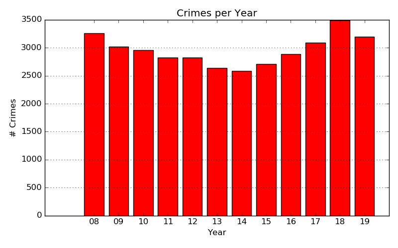
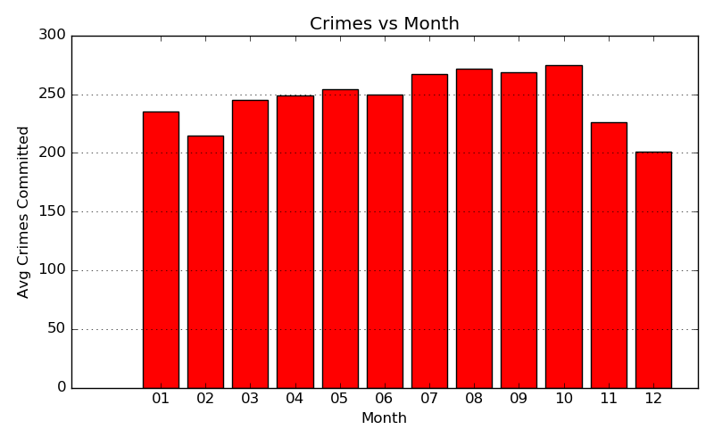
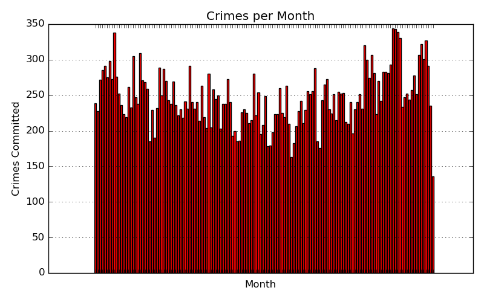

  <h1 align="center">
	  Boulder Police - Offenses (2008-2019)
  </h1>
  

## Table of Contents
1. [Introduction](#Introduction)
2. [Data](#data)
3. [When is crime most active?](#Boulder-County-Offenses)
4. [What types of crime occur in Boulder?](#when-these-offenses-occur?)
5. [Where are crimes being committed?](#When)
6. [Greatest factors in Boulder crime](#Factors)
6. [Additional Questions](#Additional-Questions?)

## Introduction

The Boulder Police department works to reduce crime, protect life, and keep Boulder properties safe. The city of Boulder varies in diveristy and population over the course of the year. This study hopes to investigate the influences that the student population may have on the city. The study's main focus will be determining when and where felony offenses are occuring and if these trends are impacted by the Univeristy of Colorado.

## Data

The data was obtained from the city of Boulder's webpage at [site](https://bouldercolorado.gov/open-data/department/police). The data was formatted as a CSV with 7 columns and 35,000 rows. The data was in good condition with the exception of about 200 rows. These rows had missing street numbers or mispelled address's. 

| Column Names  | Description   |
| ------------- | ------------- | 
| X             | Longitude     |              
| Y             | Latitude      |
| OBJECTID      | Primary Key   | 
| REPORTNUM     | Report Number |
| REPORTDATE    | Date          |
| BLOCKADD      | Street Address|
| OFFENSE       | Felony Offense|

## When is crime most active?

The first question I was interested in was determining the total number of crimes commited from 2008-2019. The resulting graph shows that crimes were decreasing from 2008 to 2014. After 2014, crimes in Boulder seemed to start increasing again. Being curious about this trend, I researched possible reasons that this may have occurred. What I found interesting was that the Boulder Chief of police resigned at the end of 2014. He was replaced the new Chief Ken Koch. This change in the Boulder police department may have lead to different policing policies.

Similar to the graph above, I decided to graph crimes agaisnt months. In this graph, I see another trend in which the months from July to October have a higher crime rate. This uptick in crime is due to the Univeristy of Colorado's fall term.

Taking this one step further, We can look at the distribution of crimes committed each month from 2008-2019. The resulting chart shows trends we saw in the two figures above.

## What types of crime occur in Boulder?

The next progression in my study was to determine the different types of crimes in Boulder. Most crime in Boulder comes from destruction of property or burglary. I imagine burglary is high since many residents often leave thier doors unlocked. What is surprising, even for Boulder, is the low rate of homicides committed. This graph represents the total occurences of each offense meaning that about 1.8 homicides happen a year in boulder.

## Where are crimes being committed?

| Locations     | Count         |
| ------------- | ------------- | 
| 4500 Block 19th St            | 246 |              
| 1000 Block Canyon Blvd        | 225 |
| 1400 Block Walnut St          | 213 | 
| 1100 Block 13th St            | 210 |
| 1400 Block Canyon Blvd        | 207 |
| 1600 Block 30th St            | 202 |
| 2900 Block Baseline Rd        | 199 |
| 3300 Block 28th St            | 191 |
| 2900 Block E Aurora Ave       | 184 |

The latitude and longitude coordinates were very interesting pieces of information for my analysis. Using these coordinates I could create a heat map depicting the various crime prone areas. Most crime in Boulder is consolidated around Univeristy Hill, a common location for fraternaties, and Pearl Street, the main location for shopping, restuarants, and bars.

Obervations:
1. Pearl Street
2. University Hill
3. Heat spot at Fire Boulder Department
4. Heat spots are very seasonal

## Greatest factors in Boulder crime

Most of my data has made it apparent that seasons may have a strong influence on crime. To gain more insite in this possible correlation, I decided to graph my data in terms of season and day. The resulting graph has many noticeable features including what days are most popular for commiting crimes.

Main Discoveries:
1. Crime peaks in Summer and Fall seasons.
2. People commit crime less during the Winter.
3. Crime is less on Saturday and Sunday.
4. Most criminal activity is peaks on Fridays.
5. Top felony offenses are from vandalism and burglary.

## Additional Questions

My main takeaway for this project was to better understand the types of crime in Boulder and where these incidents occur. Going forward I would be fascinated to statistically test observations made above. The several graphs seem to indicate that there is some type of correlation between crime and season. To further improve this project, I would want to pursue a hypothesis test between crime and season.

