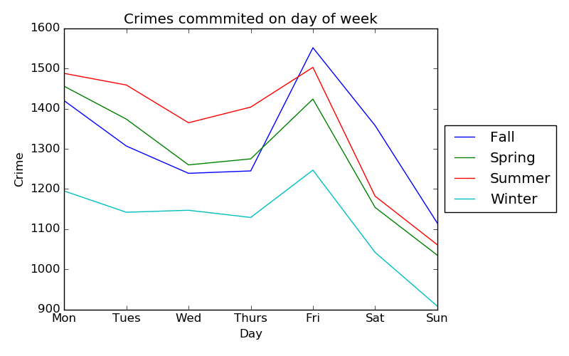

  <h1 align="center">
	  Boulder Police - Offenses (2008-2019)
  </h1>
  

## Table of Contents
1. [Introduction](#Introduction)
2. [Data](#data)
3. [Boulder County Offenses](#Boulder-County-Offenses)
4. [When Boulder Offenses occur](#when-these-offenses-occur?)
5. [Analysis?](#Data-interpretation?)
6. [Additional Questions?](#Additional-Questions?)

## Introduction

The Boulder Police department works to reduce crime, protect life, and keep Boulder properties safe. The city of Boulder varies in diveristy and population over the course of the year. This study hopes to investigate the influences that the student population may have on the city. The study's main focus will be determining when and where felony offenses are occuring and if these trends are impacted by the Univeristy of Colorado.

## Data

The data was obtained from the city of Boulder's webpage at [site](https://bouldercolorado.gov/open-data/department/police). The data was formatted as a CSV with 7 columns and 35,000 rows. The data was in good condition with the exception of about 200 rows. These rows had missing street numbers or mispelled address's. 

| Column Names  | Description   |
| ------------- | ------------- | 
| X             | Longitude     |              
| Y             | Latitude      |
| OBJECTID      | Primary Key   | 
| REPORTNUM     | Report Number |
| REPORTDATE    | Date          |
| BLOCKADD      | Street Address|
| OFFENSE       | Felony Offense|

After importing the 

## When is crime most active?

The first question I was interested in was determining the total number of crimes commited from 2008-2019. The resulting graph shows that crimes were decreasing from 2008 to 2014. After 2014, crimes in Boulder seemed to start increasing again. Being curious about this trend, I researched possible reasons that this may have occurred. What I found interesting was that the Boulder Chief of police resigned at the end of 2014. He was replaced the new Chief Ken Koch. This change in the Boulder police department may have lead to different policing policies.

Similar to the graph above, I decided to graph crimes agaisnt months. In this graph, I see another trend in which the months from July to October have a higher crime rate. This uptick in crime is due to the returning Univeristy students.

## What types of crime occur in Boulder?

The next progression in my study was to determine the different types of crimes in Boulder. Most crime in Boulder comes from destruction of property or burglary. I imagine burglary is high since many residents often leave thier doors unlocked. What is surprising, even for Boulder, is the low rate of homicides committed. This graph represents the total occurences of each offense meaning that about 1.8 homicides happen a year in boulder.

## Where are crimes being committed?

The latitude and longitude coordinates were very interesting pieces of information for my analysis. Using these coordinates I could create a heat map depicting the various crime prone areas. Most crime in Boulder is consolidated around Univeristy Hill, a common location for fraternaties and Pearl Street, the main shopping, restuarants, and bar location in Boulder. 

Strange Obervations:
1. Heatspot at Fire Boulder Department
2.

